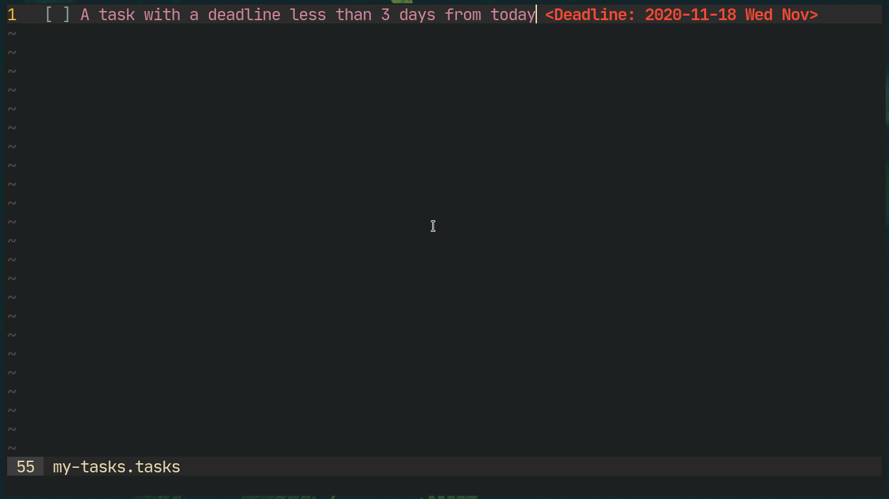

# Neovim Tasks
Manage tasks with ease in Neovim with the power and speed (compared to VimL) of Lua.


# Installation
Using Neovim's builtin package system.
```sh
git clone https://github.com/shoumodip/nvim-tasks ~/.config/nvim/pack/plugins/start/nvim-tasks
```

You can also use any package manager of your choice.

# File Detection
- You can name the file as `FILENAME.tasks`.

# Tasks
## New Task
New tasks are unmarked.\
`O` Create new task above current task in *Normal Mode*\
`o` Create new task below current task or if the current line is empty, create a task in the current line in *Normal Mode*\
`<Return>` Create new task below current task in *Insert Mode*


## Ongoing Tasks
Ongoing tasks are marked with a `-`.


## Completed Tasks
Completed tasks are marked with the date of completion and a `✕`.


## Cancelled Tasks
Cancelled tasks are highlighted as a comment, 'strike-throughed' and are marked with a `X`.


## Cycle State
`<Tab>` cycles the state of a task from 'New' to 'Ongoing' to 'Completed' to 'Cancelled' and back to 'New' in *Normal Mode*.

## Move Tasks
`K` Move current item up in *Normal Mode*\
`J` Move current item down in *Normal Mode*

# Deadlines
`t` Add a deadline for a task in *Normal Mode* if not present. This will ask three questions -- the date, month and year. The current date will be used if `Return` is pressed without any input. Use `C-c` in the 'input prompt' to cancel. If a deadline is present for the current task, `t` will remove the deadline.


## Near Deadlines
Deadlines which are less than 3 days away, are highlighted as a warning. This is **really** useful as it can be seen at a glance the deadlines approaching and the urgent tasks without inspecting the dates.



## Over Deadlines
Deadlines which are over are highlighted as a comment, because they don't matter anymore (duh).


## Other Keybindings
`R` Refresh the notes and the deadlines to check if they are over or near.\
`cc` Edit the entire task as well as the deadline (if any).\
`C` Edit only the task and not the deadline (if any).

# License
MIT
